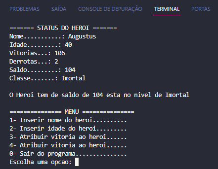

<h1 align="center">Ranked games calculator:</h1>

## 📖 About the project
In this project, I created an interactive program through an easy and intuitive menu. The menu is composed of conditionals and loops, with basic information validation. After each input, the program automatically updates the information. <br>
I chose the C language for this project as I wanted to practice it and, not only that, but also to employ a lower-level language for the logic and programming challenges of the DIO 'Potência Tech iFood - Programming from Scratch' bootcamp."



### 2️⃣ Ranked Matches Calculator
**What should be used**

- Variables
- Operators
- Loops
- Decision Structures
- Functions

### Objective:

Create a function that takes the number of victories and defeats of a player as parameters,
then return the result to a variable; the Ranked Matches balance should be calculated through the formula (victories - defeats).

If victories are less than 10 = Iron <br>
If victories are between 11 and 20 = Bronze <br>
If victories are between 21 and 50 = Silver <br>
If victories are between 51 and 80 = Gold <br>
If victories are between 81 and 90 = Diamond <br>
If victories are between 91 and 100 = Legendary <br>
If victories are greater than or equal to 101 = Immortal

### Output

In the end, display the message:
"The hero has a balance of **{victoryBalance}** and is at the level of **{level}**"

## 🦾 Technologies used
<div style="display: flex;">
  


</div>

## 🤔 What i learned
- Basically, I just improved my skills in something I already know because this bootcamp challenge is a basic introduction to coding.

## 👽 How to clone this project

````bash
    # Select where you want to clone
    $ cd ~/Documents/WHERE_YOU_WANT
````

````bash
    # Clone the project
    $ git clone https://github.com/DevGustavus/REPOSITORY_NAME.git
````

````bash
    # Check if cloning worked fine
    $ cd ~/Documents/DIRECTORY_LOCATION
    $ ls
````
